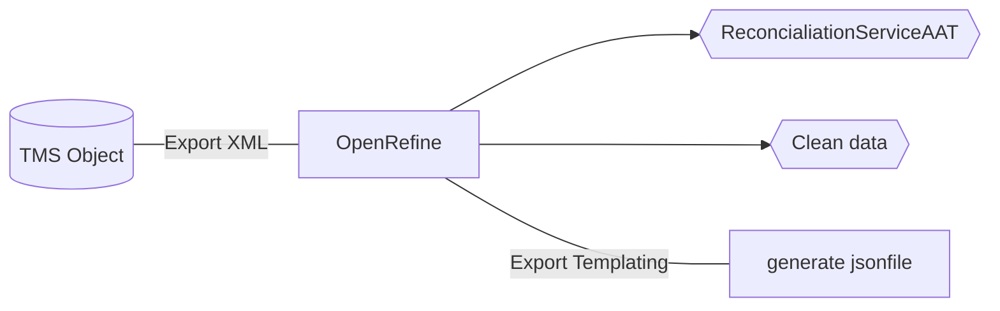

## VanGoghDataproject

Test data sets to participate in the Vang Gogh Wolrdwide project (https://vangoghworldwide.org/).

### Documentation 
* Providing data to the vangoghworldwide.org platform > github documentation : https://github.com/vangoghworldwide/linkedart
* To validate data : https://cloud.spinque.com/vangoghworldwide/prototype/linkedart

### Contents of the repository  

* 32 json files that match :
  * 24 paintings of Van Gogh
  * 8 drawing of Van Gogh
* OpenRefine export templating

### Process 

### Details and examples of cases
