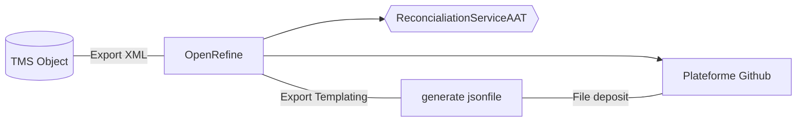

## VanGoghDataproject

Test data sets to participate in the Vang Gogh Wolrdwide project (https://vangoghworldwide.org/).

### Documentation 
* Providing data to the vangoghworldwide.org platform > github documentation : https://github.com/vangoghworldwide/linkedart
* Linked Art is a Community working together to create a shared Model based on Linked Open Data to describe Art : https://linked.art/
* To validate data : https://cloud.spinque.com/vangoghworldwide/prototype/linkedart

### Contents of the repository  

* 32 json files that match (the name of the file corresponds to the number of the catalog raisonné by La Faille:
  * 24 paintings of Van Gogh
  * 8 drawing of Van Gogh
* OpenRefine export templating

### Process 



### Details and examples of cases

#### First step 
Example of technical information ofr Van gogh painting in the TMS XML export 
```xml
<materiel-technique num-ordre="1">peinture</materiel-technique>
```
 
#### second step 
In OpenRefine, we align painting with the Getty's AAT to get both the English label and the concept id

| technique_xml_exportTMS | technique_aat_label                          | technique_aat_id             |
|------------|--------------------------------------|-------------------------|
| peinture      | painting                  | 300054216            |

#### Third step 

Export templating
```json
"technique": [
      {
        "id": "http://vocab.getty.edu/aat/{{jython:return cells["technique_aat_id"].value}}",
        "type": "Type",
        "_label": "{{jython:return cells["technique_aat_label"].value}}"
      }
```
#### Result 

```jsonld
"produced_by": {
    "type": "Production",
    "technique": [
      {
        "id": "http://vocab.getty.edu/aat/300054216",
        "type": "Type",
        "_label": "painting"
      }
    ],
```

